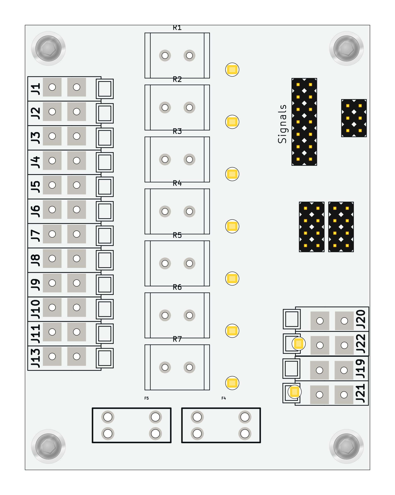
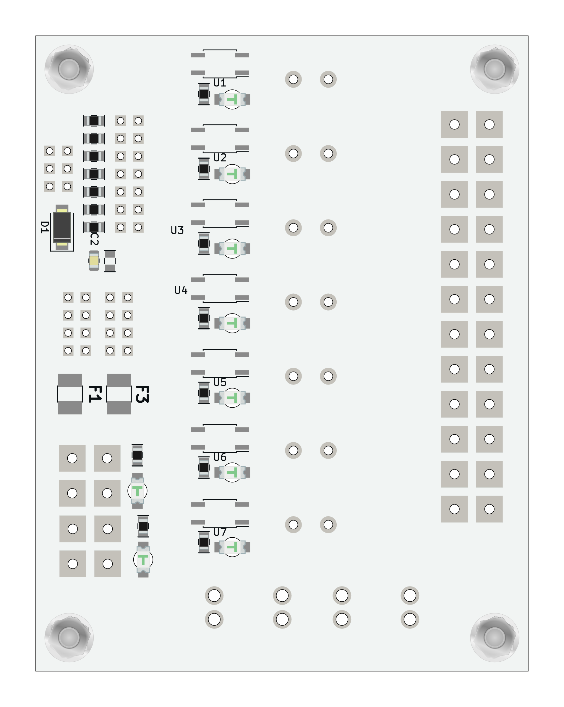

#  ISO11446PWR01 - Trailer emulator

[ISO 11446 specifies a 13-pole electrical connector](https://en.wikipedia.org/wiki/ISO_standards_for_trailer_connectors#13-pin_trailer_connector_(ISO_11446)) between towing and towed vehicles with 12 volt electrical system. The module emulates connection of the trailer to get power supply and commands signals for connected devices. 

